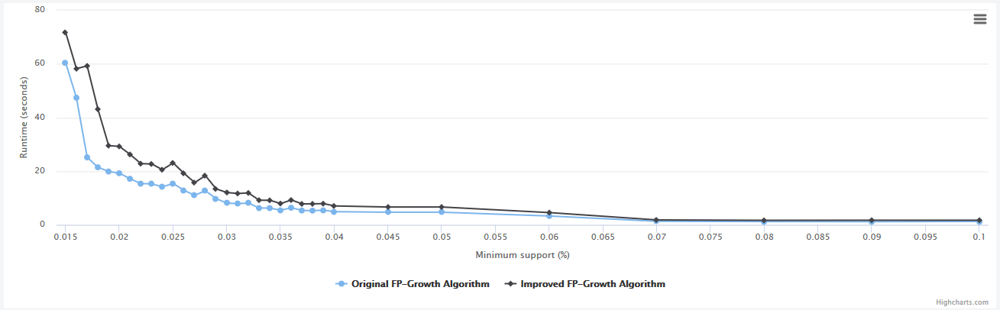

# fp-growth

This project shows that the "..." proposed by ... is in fact performing worse than the original "..." by ...

## Usage

**Run benchmarks**

```
$ go test -v -run=TestBenchmarkMin* -timeout 99999s .
```

**Run all tests**

```
$ go test .
```

**Run all tests without benchmarks**

```
$ go test -short .
```

## Results

